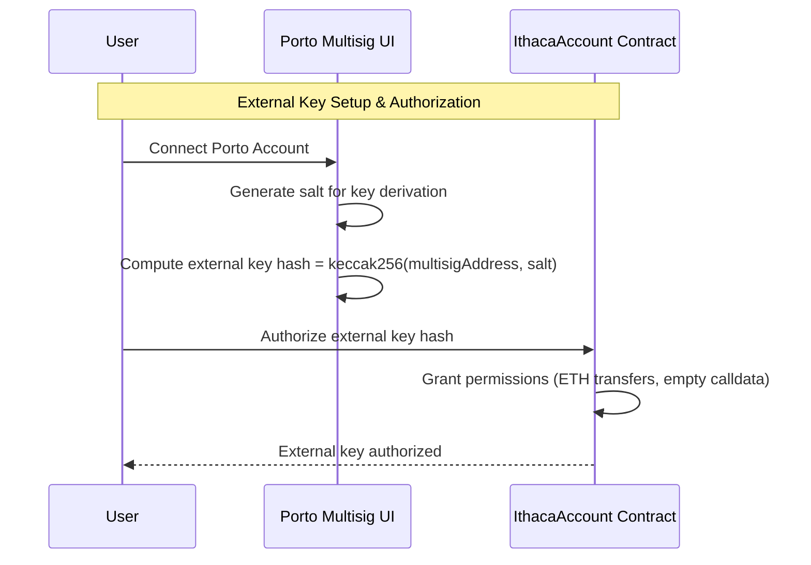
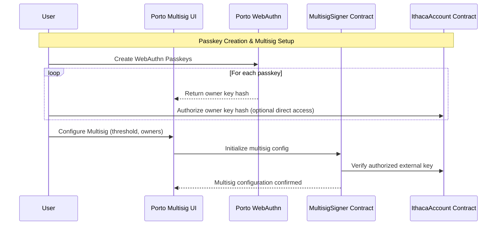
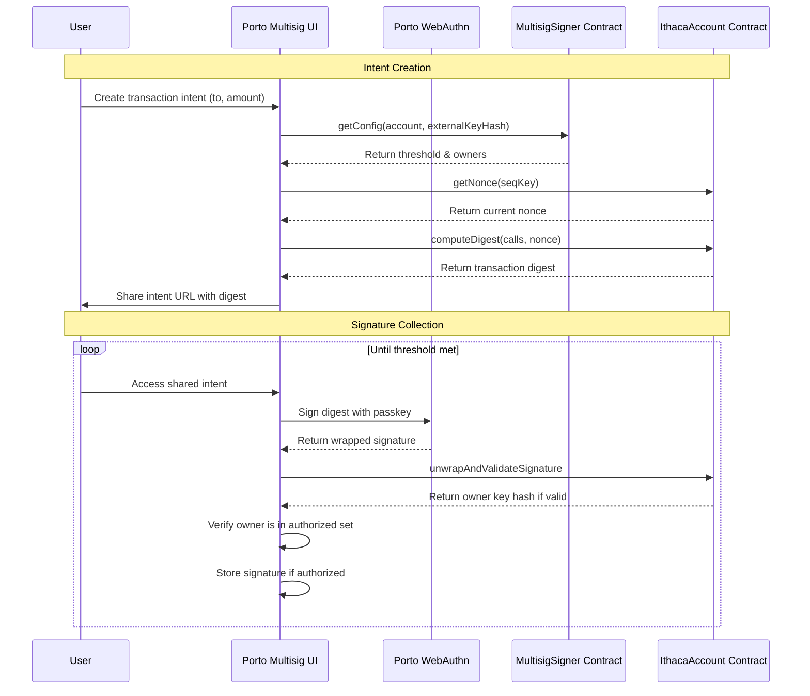
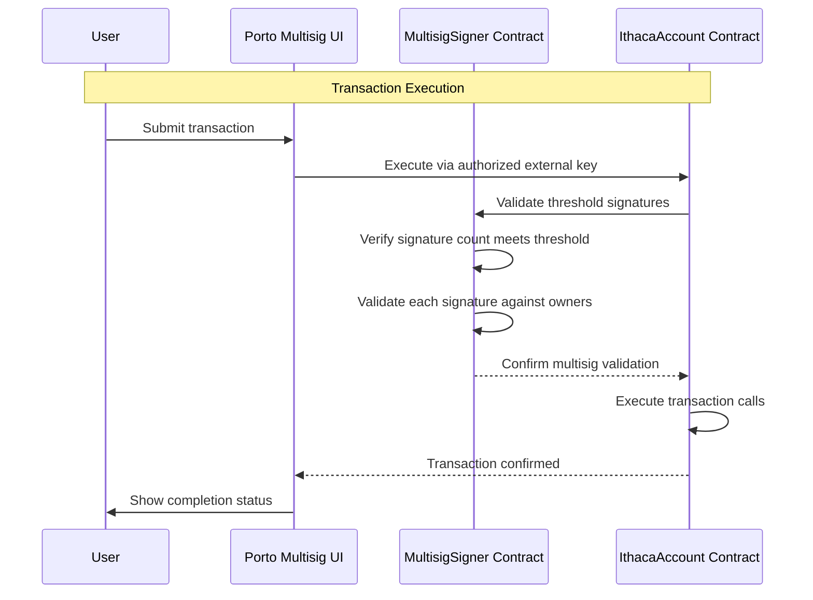

# Porto Multisig UI Flow Documentation

This document describes the complete flow of the Porto Multisig application, from setup to transaction execution.

## Overview

The Porto Multisig UI is a web interface for creating and managing multisig transactions using Porto WebAuthn passkeys. It consists of three main sections:
- **Setup**: Configure the multisig with passkeys and permissions
- **Create Intent**: Create transaction intents for signing
- **Sign Intent**: Collect signatures and submit transactions

## Background & Key Concepts

### External Key Hash
The **external key hash** is a unique identifier for a "policy key" that delegates signature verification to the MultisigSigner contract:

- **Computation**: `keccak256(abi.encode(KeyType.External(3), keccak256(abi.encodePacked(multisigAddress, salt))))`
- **Purpose**: Identifies the multisig policy on the IthacaAccount contract
- **Not account-specific**: Same hash for the same MultisigSigner address + salt combination
- **Account binding**: Must be explicitly authorized on each IthacaAccount that will use it

### Multisig Configurations per Account
A single IthacaAccount can have **multiple independent multisig configurations**:

- **Storage**: Configs keyed by `(account, externalKeyHash)` in MultisigSigner contract
- **Isolation**: Each config has its own threshold, owners, and operates independently
- **Flexibility**: Different external key hashes (via different salts) create separate multisigs

### Why Permissions Are Mandatory

#### Call Permissions (`canExecute`)
**What**: Whitelist of `(target, functionSelector)` pairs that a key can invoke
**Why**: GuardedExecutor rejects unauthorized calls unless explicitly allowed
- Fails with `UnauthorizedCall` if permission missing
- Empty calldata uses special pseudo-selector
- Grant via: `setCanExecute(keyHash, target, fnSel, true)`

#### Spend Permissions
**What**: Per-token spending limits with configurable periods (Minute/Hour/Day/etc.)
**Why mandatory**: At least one spend period must be configured per token
**Enforcement**:
- Fails with `NoSpendPermissions` if no limits set
- Spend tracking per token/period
- Grant via: `setSpendLimit(keyHash, token, period, limit)`

#### Relayer Independence
The **relayer sending the transaction does not affect permission requirements**:
- Enforcement uses the **recovered keyHash from signature**, not transaction sender
- External multisig keys are **not super admin by default**
- Permissions must be set regardless of relayer usage

**Minimum Required Permissions for ETH Transfers**:
1. **Call Permission**: Allow empty calldata to any target
2. **Spend Permission**: Set ETH limit (token = `address(0)`) with appropriate period

## Flow Diagrams

The complete multisig flow is broken down into four key phases:

### Phase 1: External Key Authorization

The external key serves as the execution key that will submit transactions on behalf of the multisig. The user must explicitly authorize this key on their IthacaAccount contract with specific permissions. This authorization is mandatory because GuardedExecutor enforces call and spend permissions for all non-super-admin keys.

### Phase 2: Passkey Setup & Multisig Configuration

Users create WebAuthn passkeys through Porto, each generating a unique owner key hash. These are optionally authorized on the account for direct access. The multisig is then configured with a threshold and the list of authorized owners.

### Phase 3: Intent Creation & Signature Collection

An intent is created with transaction details, and the system computes a digest that signers will sign. Multiple signers access the shared intent and provide signatures using their Porto passkeys until the threshold is met. For now, only basic intents (transferring ETH from the account) are supported. In the future, more complex transactions will be supported.

### Phase 4: Transaction Execution

Once the threshold is met, any authorized user can submit the transaction. The account contract validates the multisig signatures through the MultisigSigner contract before executing the actual transaction calls.

## Development Notes

### Environment Setup
- Requires `NEXT_PUBLIC_MULTISIG_SIGNER` environment variable
- Connects to Base Sepolia testnet (chainId: 84532)
- Uses Porto library for WebAuthn operations

Happy coding 🎉